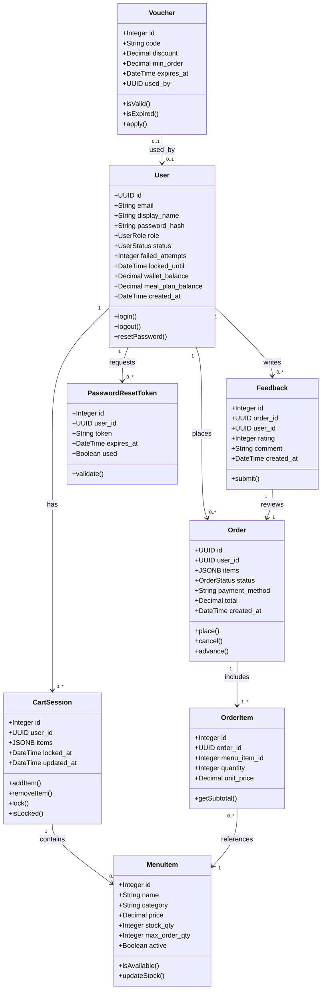

# 🍽️ CampusBite
### University Cafeteria Ordering System

> Order smarter. Eat better. Built for campus life.


---

## 📌 What is CampusBite?

CampusBite is a full-stack university cafeteria ordering platform that lets students browse the menu, build a cart, apply vouchers, and place orders — all from their phone or desktop. Staff manage order fulfilment in real time, and administrators control the entire system from a dedicated panel.

Built as a vertical-slice team project for CSE323, with each member owning a complete feature slice from database to UI.

---

## ✨ Features

| Feature | Description |
|--------|-------------|
| 🔐 Authentication | University SSO login, JWT sessions, brute-force protection |
| 🍔 Menu & Cart | Browse by category, search, add to cart, apply vouchers |
| 📦 Order Placement | Real-time stock checks, idempotent order submission |
| 💳 Payment | Online, Cash, Wallet, and Meal Plan support |
| 🔄 Order Lifecycle | Full state machine from PLACED → COLLECTED |
| 💸 Refunds | Automatic refund triggers with audit trail |
| ⭐ Feedback | Star ratings and reviews per completed order |
| ⚙️ Admin Panel | Full system control — users, menu, reports, config |

---

## 🏗️ Architecture

```
┌─────────────────────────────────────────────┐
│                  Frontend                    │
│           React + Bootstrap CSS              │
│   Menu │ Cart │ Orders │ Admin │ Tracking    │
└────────────────────┬────────────────────────┘
                     │ HTTP / REST
┌────────────────────▼────────────────────────┐
│                Backend API                   │
│              Python + Flask                  │
│  Auth │ Menu │ Orders │ Payment │ Lifecycle  │
└────────────────────┬────────────────────────┘
                     │
┌────────────────────▼────────────────────────┐
│                 Database                     │
│               PostgreSQL                     │
│  users │ menu_items │ orders │ vouchers ...  │
└─────────────────────────────────────────────┘
```

---

## 📐 UML Class Diagram



---

## 👥 Team & Ownership

| Member | Slice | Branch | FRs |
|--------|-------|--------|-----|
| Member 1 | Authentication & Identity | `feature/auth-identity` | FR01–FR08 |
| Member 2 | Menu & Cart | `feature/menu-cart` | FR09–FR19, FR52 |
| Member 3 | Order Placement & Payment | `feature/order-payment` | FR20–FR33 |
| Member 4 | Order Lifecycle & Refunds | `feature/lifecycle-refunds` | FR34–FR46 |
| Member 5 | Feedback & Admin | `feature/feedback-admin` | FR47–FR56 |

---

## 🗄️ Database Schema

```
users               menu_items          orders
─────────────       ──────────────      ──────────────
id                  id                  id (UUID)
email               name                user_id
password_hash       category            items (jsonb)
role                price               status
active              stock_qty           payment_method
created_at          max_order_qty       total
                    active              created_at

vouchers            cart_sessions       order_items
─────────────       ──────────────      ──────────────
id                  id                  id
code                user_id             order_id
discount            items (jsonb)       menu_item_id
expires_at          locked_at           quantity
used_by             updated_at          unit_price
```

---

## 🚀 Getting Started

### Prerequisites
- Python 3.12+
- Node.js 20+
- PostgreSQL 18

### 1. Clone the repo
```bash
git clone https://github.com/MohamedIbrahim120230230/CampusBite.git
cd CampusBite
```

### 2. Set up the database
```bash
psql -U postgres -d cafeteria -f database/migrations/001_create_auth.sql
psql -U postgres -d cafeteria -f database/migrations/002_create_menu_cart.sql
```

### 3. Run the backend
```bash
cd backend/menu
python -m venv venv
venv\Scripts\activate        # Windows
pip install flask flask-cors psycopg2-binary python-dotenv
python app.py                # Runs on http://localhost:5001
```

### 4. Run the frontend
```bash
cd frontend/menu-cart
npm install
npm start                    # Opens http://localhost:3000
```

---

## 🔌 API Endpoints (Member 2 — Menu & Cart)

| Method | Endpoint | Description | FR |
|--------|----------|-------------|-----|
| GET | `/api/menu` | Browse menu, filter by category | FR09 |
| GET | `/api/menu/search?q=` | Full-text search | FR10 |
| GET | `/api/cart/:user_id` | View cart | FR12 |
| POST | `/api/cart/:user_id/add` | Add item to cart | FR11 |
| POST | `/api/cart/:user_id/voucher` | Apply voucher | FR13 |
| POST | `/api/cart/:user_id/lock` | Lock cart at checkout | FR17 |
| POST | `/api/admin/menu` | Create menu item | FR18 |
| PUT | `/api/admin/menu/:id` | Update menu item | FR18 |
| DELETE | `/api/admin/menu/:id` | Deactivate menu item | FR18 |

---

## ⚠️ Edge Cases Implemented

- **FR14** — Voucher rejected if expired, already used, or below minimum order
- **FR15** — Voucher stacking rejected with clear error message
- **FR16** — Cart total floored at 0 on over-discount (no negative totals)
- **FR17** — Cart locked read-only on checkout entry
- **FR19** — Max quantity cap enforced per item at cart level

---

## 📋 Requirements Coverage

56 Functional Requirements · 24 Edge Cases · 32 Non-Functional Requirements

See [`docs/`](./docs) for the full SRS and vertical slice breakdown.

---

## 📄 License

MIT — see [LICENSE](./LICENSE) for details.

---

<p align="center">Built with ☕ by the CSE323 Team — EJUST 2026</p>
